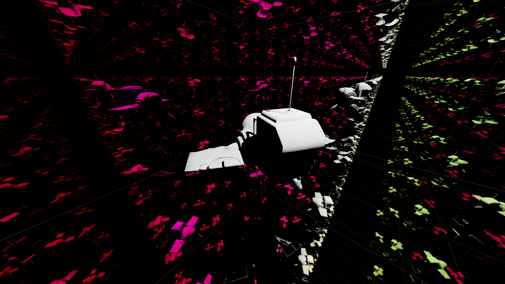

## Tracer-Inator

Tracer-Inator is a C++17 CPU-based Whitted ray tracer developed for Chaos Camp 2026. The project simulates realistic light behavior by combining classic ray-tracing algorithms with modern sampling techniques:

  - Material System: Supports diffuse (Lambertian), reflective (mirror-like), and refractive (dielectric) surfaces.

  - Lighting Model: Utilizes point lights to calculate direct illumination, specularity, and sharp shadows.

  - Sampling & Anti-Aliasing: Incorporates Monte Carlo–inspired iterative sampling techniques for smooth anti-aliasing (AA) and reduced image noise.

-----

